

# Manual do Usuário – Racha Eventos

Bem-vindo ao <strong>Racha Eventos</strong>, a plataforma simples e eficiente para gerenciar seus eventos com facilidade!

Este manual foi criado para ajudar você a utilizar todas as funcionalidades do site, garantindo que seus eventos sejam cadastrados corretamente, os participantes sejam adicionados facilmente, e os custos sejam divididos de forma justa.

## Objetivo do Racha Eventos

O site <strong>Racha Eventos</strong> permite que você:

- <strong>Cadastre seus eventos</strong>: crie e organize eventos de forma rápida e intuitiva.
- <strong>Adicione pessoas</strong>: convide e insira os participantes envolvidos em cada evento.
- <strong>Divida o valor da conta</strong>: faça o rateio automático dos custos entre os participantes.
- <strong>Realize pagamentos</strong>: acompanhe os pagamentos e facilite a quitação das despesas.

Com o <strong>Racha Eventos</strong>, gerenciar as finanças do seu evento fica mais simples, transparente e colaborativo.

## Meus eventos

Criar novo evento

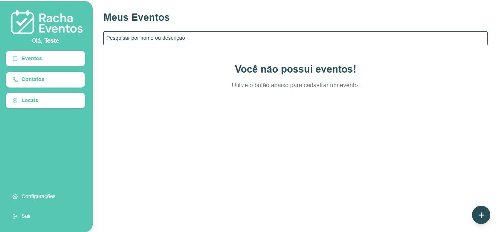

Nesta tela, você poderá visualizar todos os eventos que criou ou participa. É possível cadastrar novos eventos, editar informações, consultar detalhes e acompanhar o status financeiro de cada evento.

Ao clicar no botão de "+" no canto inferior direito, um pop up será aberto onde você pode cadastrar seu evento, a descrição e informações principais:

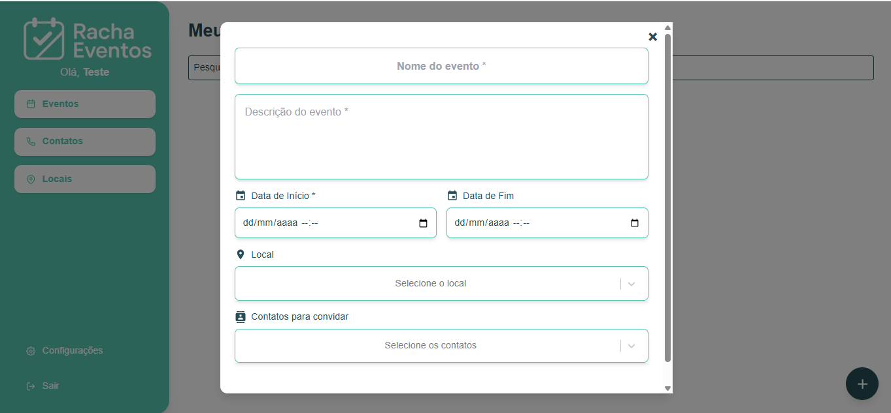

Após cadastrar o evento, a tela ficará assim:

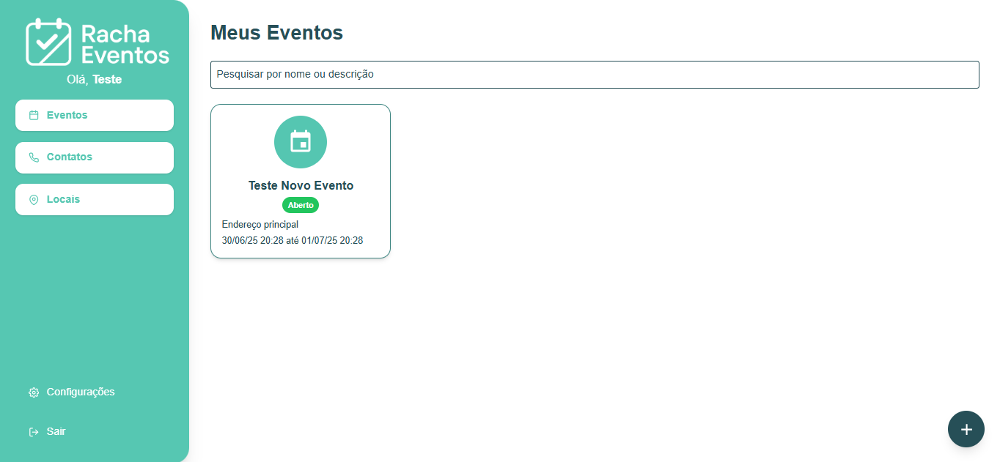

Resumo

Esta tela está disponível na aba **"Resumo"** dentro do seu evento. Ela exibe informações importantes, mas de maneira resumida:

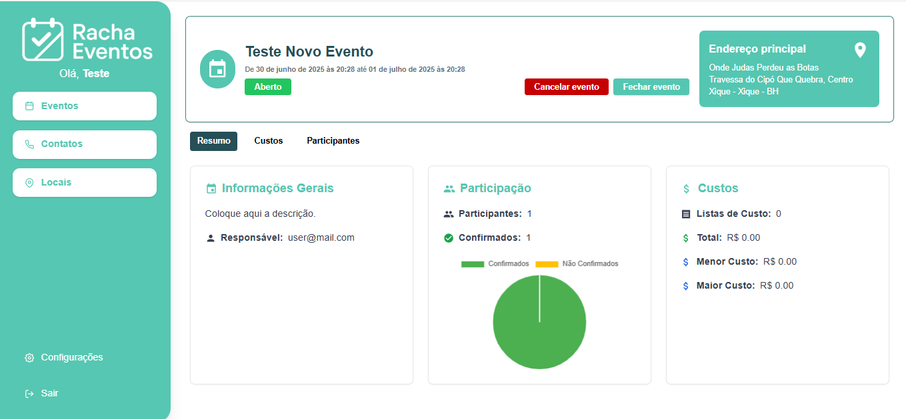

Custos

Aqui uma lista pode ser criada, no qual será informado todos os custos do seu evento:

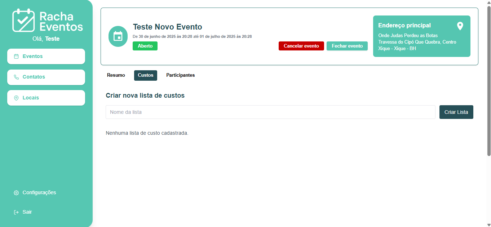

Participantes

Para adicionar os participantes do evento, clique no evento e na aba **"Participantes"**:

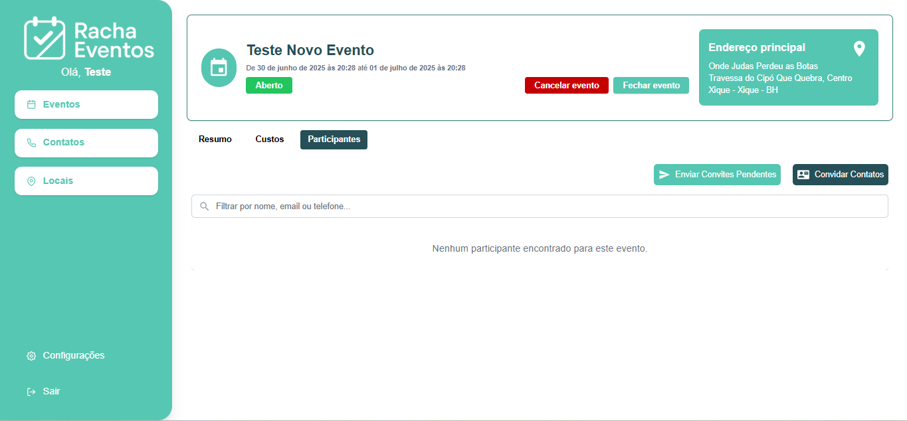

E após, em **"Convidar Contatos"**:

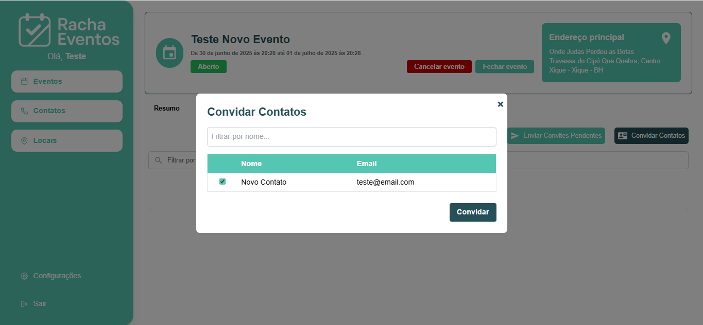

A tela ficará assim, aguardando seu contato aceitar o convite:

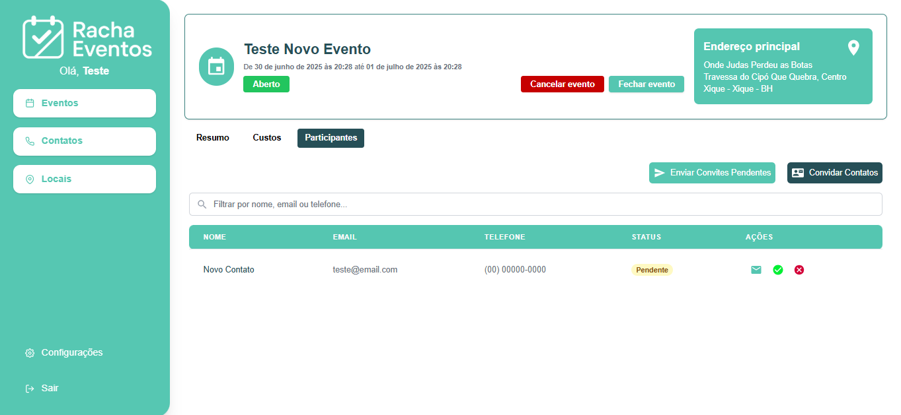

## Contatos

Novo contato

Aqui você gerencia a lista de pessoas que podem ser adicionadas aos seus eventos. Adicione, edite ou remova contatos facilmente para manter sua lista sempre atualizada:

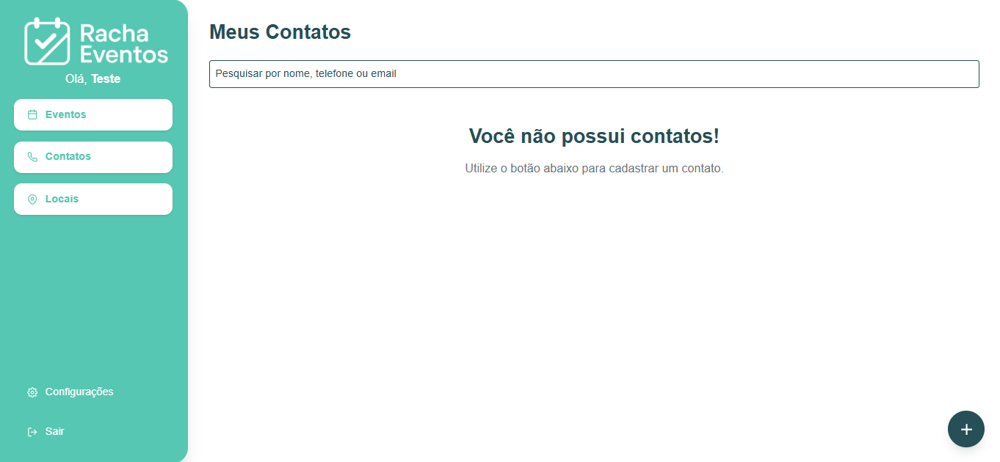

Ao clicar no botão de "+" no canto inferior direito, um pop up será aberto onde você pode cadastrar seus contatos:

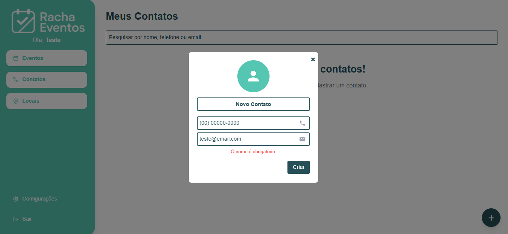

Após preencher as informações e salvar, a tela ficará assim:

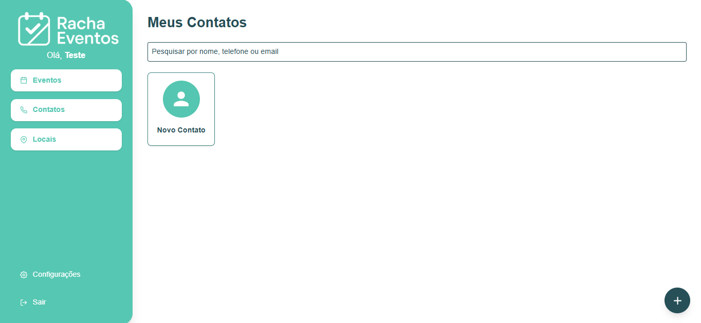

## Locais

Cadastrar novo local

Nesta tela, você cadastra e organiza os locais onde os eventos acontecerão. Pode adicionar novas localizações, editar informações de endereço e escolher o local adequado ao criar um evento:

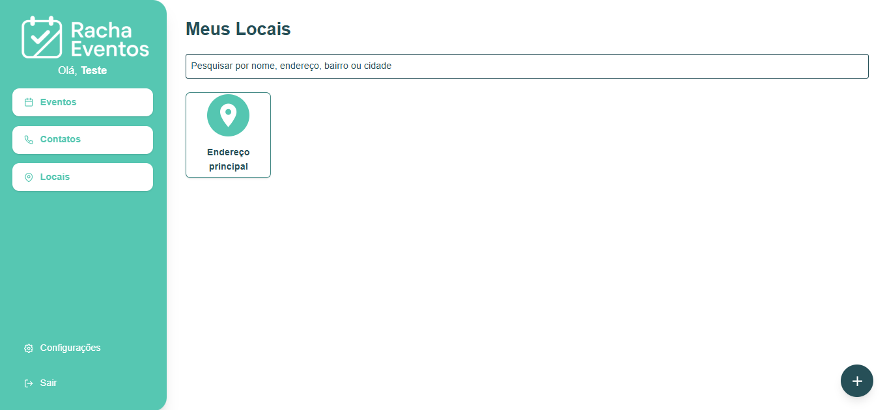

Essa tela funciona como as demais, clicando no botão inferior no canto direito, um pop up será aberto, permitindo cadastrar um local, onde mais tarde você poderá vincular aos seus eventos:

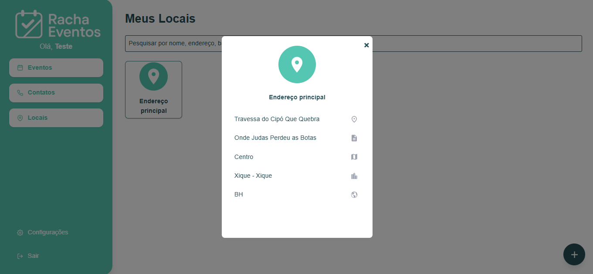

## Configurações

Atualize suas informações

Aqui você pode editar suas informações pessoais a qualquer momento:

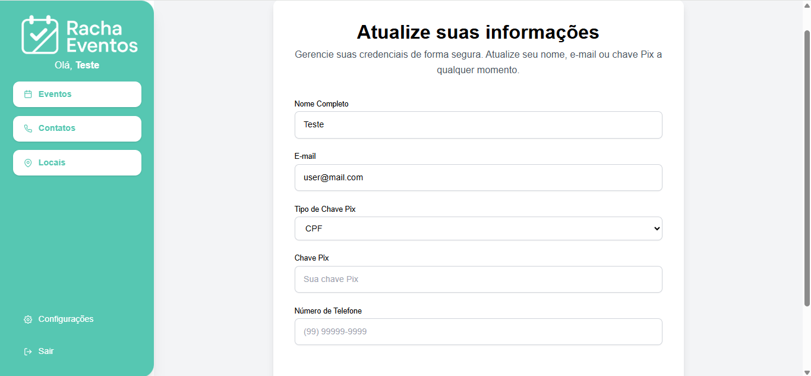

